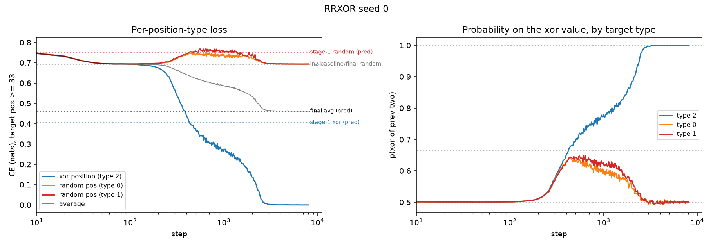
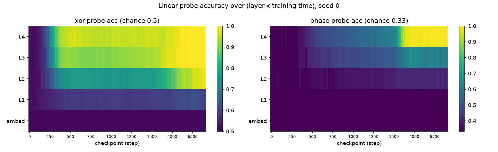
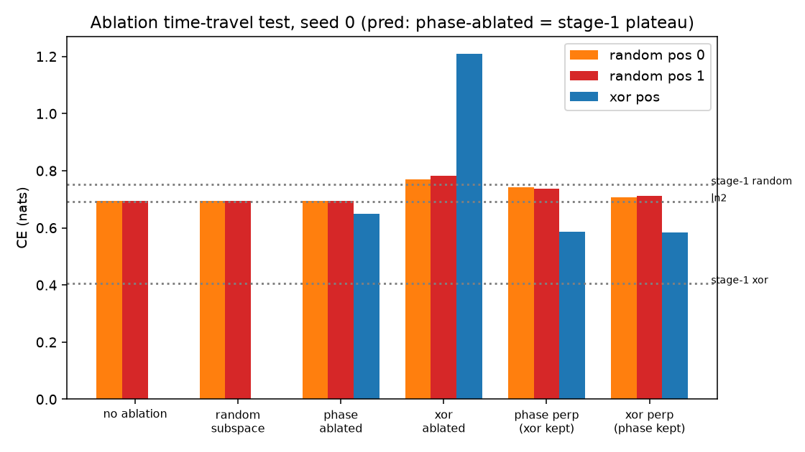
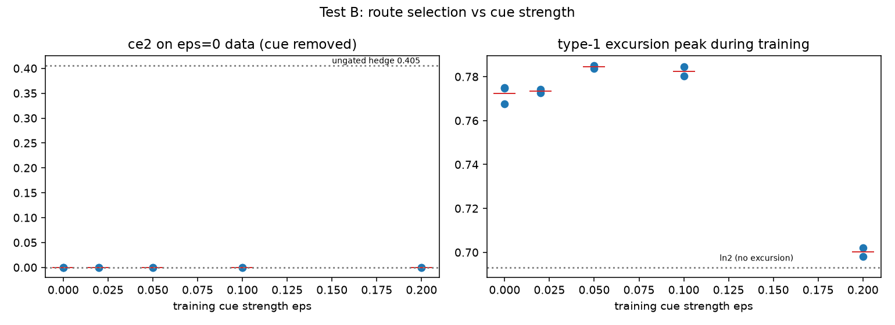
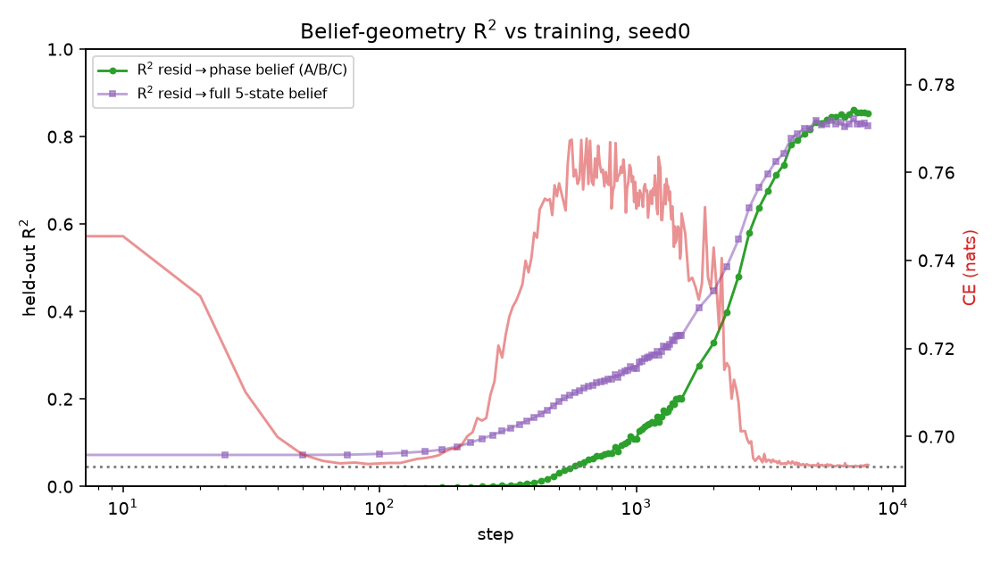
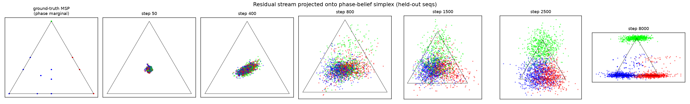

# How training builds the RRXOR circuit: preregistered learning-dynamics experiments

This directory tests a frame for **why networks learn hierarchical circuits**, using RRXOR
as a maximally clean testbed. All predictions were written down with exact numbers *before*
any experiment was run (`PREREG.md`, `PREREG2.md`) and then graded against the results
(`RESULTS.md`, `RESULTS2.md`). This document is the narrative version.

Model: 4-layer decoder-only transformer, d_model=128, 4 heads, binary vocab, sequence
length 96, online data, AdamW, 8k steps, 3 seeds. All losses in nats, measured at late
target positions (≥ 33) so phase is resolvable from context.

## The frame

Circuits are learned in order of **state-dependent gradient accessibility**: at every
moment, the network learns whatever has the most usable gradient *given the features it
already has*. Hierarchy is then not a separate assumption but a corollary — learning
circuit A changes the feature basis, which changes what has gradient next (serial gradient
concentration). Once a circuit solves a task component, the gradient for competing
implementations shuts off (preemption), freezing the structure in.

## Why RRXOR is the perfect testbed: the loss accounting

RRXOR emits repeating blocks `r1, r2, r1⊕r2` with a random per-sequence phase offset.
Call target positions **type 0/1** (the two random bits) and **type 2** (the XOR bit).
For a binary prediction (q, 1−q) against a uniform target, the loss is

```
L(q) = −½ ln q − ½ ln(1−q) = ln 2 + KL(uniform ‖ prediction)
```

i.e. ln 2 plus the price of *unjustified confidence*. Now consider the policy "bet
probability q on XOR(prev two tokens) at every position". That bet is correct 2/3 of the
time overall (always at type 2, coin-flip at types 0/1), so the optimal phase-blind hedge
is q = 2/3, giving:

| stage | type 2 (xor) | types 0/1 (random) | average |
|---|---|---|---|
| baseline (uniform) | ln 2 = 0.6931 | 0.6931 | 0.6931 |
| stage 1: ungated XOR feature, q = 2/3 | −ln(2/3) = **0.4055** | L(2/3) = **0.7520** | 0.6365 |
| stage 2: phase-gated | ~0 | 0.6931 | (2/3)ln 2 = **0.4621** |

Two structural facts make this a pure test of hierarchy:

1. **Phase has exactly zero marginal value without the XOR feature.** Knowing "the next
   token is the XOR slot" predicts nothing unless you can compute the XOR. The phase
   circuit's gradient lives entirely in the interaction term — a pure staircase.
2. **The stage-1 circuit *creates* the stage-2 subtask.** The ungated bet makes loss at
   random positions *worse* than baseline (0.693 → 0.752). That miscalibration pain is
   exactly the phase circuit's training signal. The task hierarchy is partly endogenous —
   manufactured by the network's own trajectory, not present in the raw data.

Note stage 2 is worth 3× more loss than stage 1 (0.174 vs 0.057 nats) yet is learned
second: order follows *accessibility*, not payoff.

## Round 1 (PREREG.md → RESULTS.md)

### Prediction 1 — non-monotonic subtask loss: confirmed on the numbers



All 3 seeds: random-position loss descends to ln 2 (~step 100, calibration learned), is
**pushed back up** while the XOR circuit forms — type-0 peaks 0.749/0.749/0.751 against
the parameter-free prediction 0.752 — plateaus, then relaxes to ln 2 as gating completes.
Final averages 0.4621–0.4623 (predicted 0.4621). The right panel shows the mechanism
directly: during the plateau the model bets ~2/3 on the XOR value at *all* position types
(the ungated policy), then the curves split to 1.0 / 0.5 (gated).

A subtask loss that rises and falls is something no rival account predicts — frequency
ordering never sends a loss the wrong way, and a static complexity ordering doesn't either.

(The starting loss ~0.78 is *not* the same number as the 0.752 plateau, despite appearing
close: at init the excess above ln 2 is KL from *random* unstructured confidence, set by
the init scale, equal across all position types. The plateau is *systematic* confidence in
the XOR direction — 0.405 at type 2, 0.752 at types 0/1, pinned by task statistics.)

### Prediction 2 — emergence time = depth = causal dependency: confirmed



Linear probes over (layer × checkpoint), all seeds: the XOR feature becomes decodable at
L2–L4 from step ~300 (phase still at chance everywhere); phase becomes decodable **only at
L4**, from step ~1500–2500 — later in time and strictly past the XOR feature's write layer.

### Prediction 3 — ablation "time travel": failed, informatively

Preregistered: mean-ablating the phase subspace of the final network should revert
behavior to the stage-1 plateau (peel the top circuit, go back in time).



What actually happens (after orthogonalizing the overlapping phase/XOR subspaces):

- The stage-1 **representation survives**: the XOR feature stays decodable and is causally
  load-bearing for both the output and the phase evidence — ablating it is catastrophic
  and *worse than chance* at XOR positions (up to 3.2 nats), because the gate survives and
  bets confidently on a corrupted value.
- The stage-1 **policy does not**: the unconditional 2/3 bet is actively unlearned during
  stage 2 (watch p(xor) at random positions decay 0.65 → 0.50 in the curves), so phase
  ablation only partially resurrects it (hedge ~0.55; one seed, with the most
  gate/value-entangled geometry, reverts almost exactly: 0.408 vs predicted 0.4055).

**Refined conclusion: hierarchical learning reuses the scaffold's representation and
refactors its readout.** The fossil record of training is in the features and their depth
placement, not in behaviorally recoverable strata. This is precisely the anatomy the
post-training dissection in `../circuit_analysis/` finds: an unconditional XOR shortcut
(the retained stage-1 feature) gated by an inferred phase posterior (the stage-2 addition).

## Two-route test (PREREG2 Test B → RESULTS2.md)

Add an independent *flat* route to phase: bias type-0 tokens to Bernoulli(0.5 + ε), so
phase is inferable from positional token statistics without any XOR feature. Sweep
ε ∈ {0.02, 0.05, 0.1, 0.2}. Diagnosis: evaluate trained nets on ε = 0 sequences (cue
removed) — a cue-reliant net loses phase OOD; a violation-reliant net doesn't.



Result: **no route flip anywhere in the range** — every net, even ε = 0.2, solves phase
perfectly with the cue removed (OOD ce2 ≈ 0.0001). Violation evidence is asymptotically
dominant (resolves phase in ~5–10 tokens vs ~30+ for the cue), so the cue never displaces
it. But the excursion column shows a discovery: at ε = 0.2 the stage-1 excursion
**vanishes** (peak 0.698–0.702 vs 0.77 baseline) — the cue delivers phase early enough
that the miscalibrated intermediate stage never exists, yet the final mechanism is
unchanged. **The cue changes the learning path without changing the endpoint**: early
phase access removes the stage-1 pathology, and the better evidence source is later hooked
into the already-existing phase variable. The "manufactured gradient" is one bootstrap
route to the successor circuit, not the only one.

## Coarsening trajectory (PREREG2 Test C → RESULTS2.md)

The frame's geometric version: training should traverse **coarsenings of the true belief
geometry**, refined in order of accessibility. Ground-truth beliefs come from a Bayes
filter over the 5-state generator HMM {A, B0, B1, C0, C1}; per checkpoint we ridge-regress
the layer-4 residual stream (all positions ≥ 2, held-out sequences) onto the belief.




Confirmed: during the stage-1 plateau the phase-marginal R² is ~0.00 *while the XOR
feature is already fully decodable* — the network holds exactly the phase-**marginalized
quotient** of the belief geometry. The simplex then unfolds from a color-mixed central
blob into three clean phase clusters (R² → 0.85), with two refinements: representational
progress starts (~step 500–800) while the loss is still plateaued — hidden progress
precedes behavioral change — and the geometry keeps consolidating after the loss has
converged. This matches the dissection's finding that the final network represents belief
only over the task-relevant phase quotient: that is where the coarse-to-fine refinement
stops paying.

## Reproduction

```bash
pip install -r ../requirements.txt   # numpy, torch, matplotlib

# Round 1 (one seed ≈ 2 min on one GPU; writes runs/seed0/)
python train.py --seed 0
python plot_curves.py 0        # figures + excursion summary (prediction 1)
python probe.py 0              # layer×time probe heatmaps (prediction 2)
python ablate.py 0             # subspace-ablation test (prediction 3)
python msp.py seed0            # coarsening trajectory (Test C)

# Two-route test (Test B)
python train.py --bias_eps 0.2 --tag ep20_ --seed 0 --light
python route_diag.py           # OOD route diagnosis across all ep*_ runs

# Scaffold dose-response (PREREG2 Test A, not covered above; see RESULTS2.md)
python train.py --xorbit_p 0.0 --tag xp00_ --seed 0
python tau_sweep.py
```

Logged metrics from the three main training runs are included in `data/` (`eval_seed*.jsonl`
plus analysis JSONs), so the round-1 loss figures can be rebuilt without retraining.

## File guide

| file | what it provides |
|---|---|
| `train.py` | RRXOR generator, GPT, training loop, per-position-type eval; `--bias_eps` (flat phase cue), `--xorbit_p` (input scaffold) |
| `plot_curves.py` | prediction-1 figure + excursion statistics |
| `probe.py` | linear probes for the XOR feature and phase over (layer × checkpoint) |
| `ablate.py` | class-mean subspace estimation, orthogonalized mean-ablation conditions |
| `route_diag.py` | OOD (ε=0) route diagnosis for the two-route test |
| `msp.py` | Bayes filter for the 5-state HMM, resid→belief ridge regression, simplex scatter |
| `tau_sweep.py` | emergence-time extraction for the scaffold dose-response |
| `PREREG.md` / `PREREG2.md` | predictions, written before running (unedited) |
| `RESULTS.md` / `RESULTS2.md` | results graded against the preregistrations |
