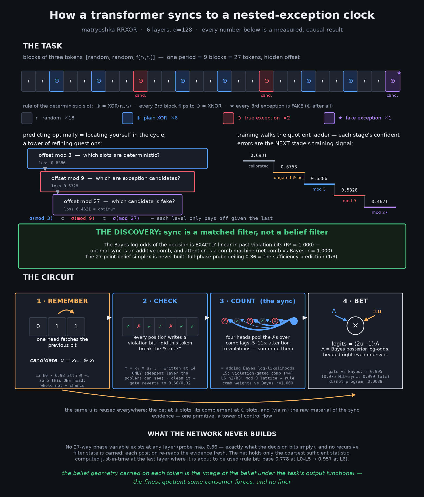
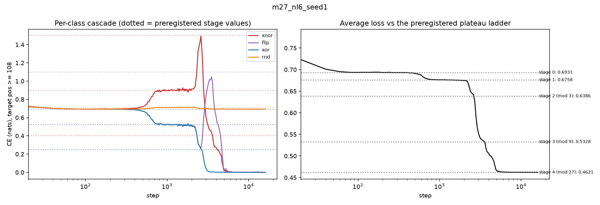
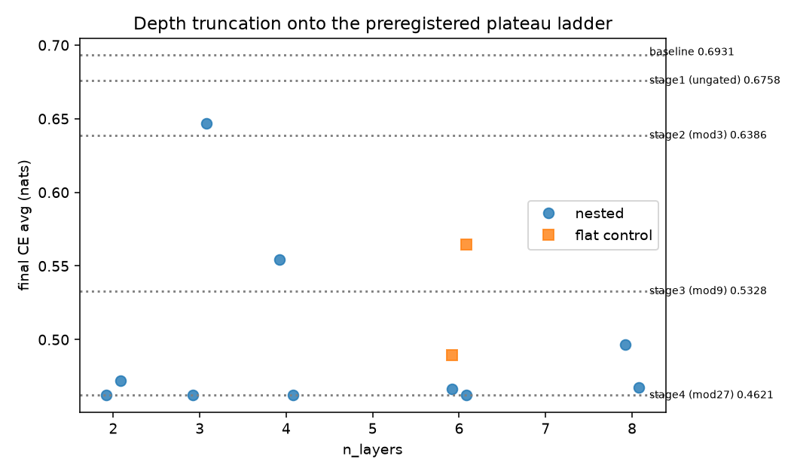
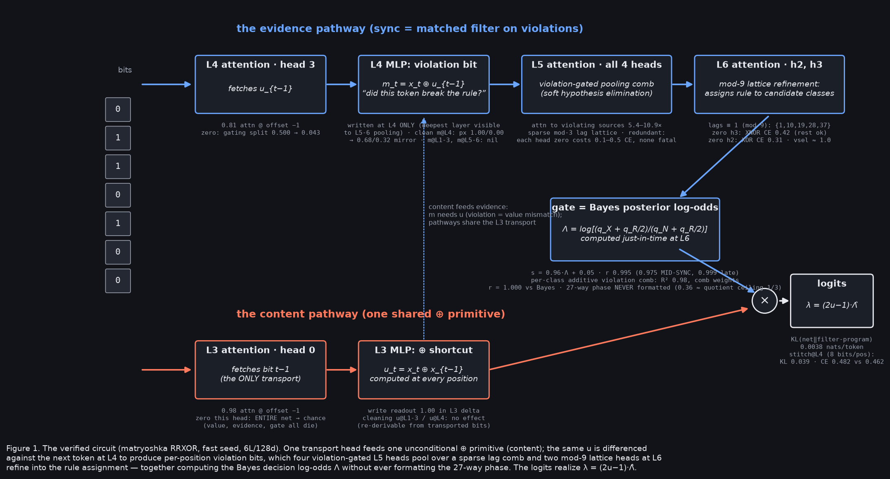
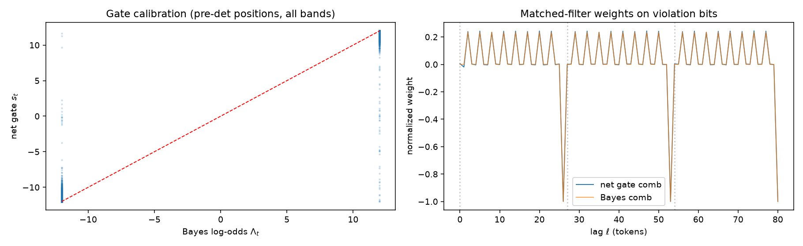

# Matryoshka RRXOR: a three-level exception tower, learned and decoded

Sequel to [`../dynamics/`](../dynamics/) (learning dynamics on plain RRXOR) and
[`../circuit_analysis/`](../circuit_analysis/) (post-training dissection). This directory
tests the hierarchy frame on a **nested** task and ends with a complete whitebox decode.
Everything was preregistered before running (`PREREG3.md`, graded in `RESULTS3.md`).



## The task

Blocks `[r1, r2, f(r1,r2)]`, rule pattern per 9-block super-period (27 tokens):
XOR everywhere except blocks {2,5} are XNOR, and block 8 — on the every-3rd-block
candidate lattice — flips back to XOR (the fake exception). One hidden offset,
uniform over 27. Quotient tower **Z27 ⊃ Z9 ⊃ Z3**. Slot classes per 27 tokens:
18 random, 6 plain-XOR, 2 true-XNOR, 1 fake (`FLIP`).

**Closed-form plateau ladder** (nats; q = probability bet on xor-of-prev-two;
det match rate 7/9, pooled 16/27):

| stage (policy) | XOR6 | XNOR2 | FLIP1 | RND | average |
|---|---|---|---|---|---|
| calibrated | 0.6931 | 0.6931 | 0.6931 | 0.6931 | 0.6931 |
| ungated q=16/27 | 0.5232 | 0.8979 | 0.5232 | 0.7106 | 0.6758 |
| mod 3 (q=7/9 at det) | 0.2513 | **1.5041** | 0.2513 | 0.6931 | 0.6386 |
| mod 9 (q=1/3 at candidates) | ~0 | 0.4055 | **1.0986** | 0.6931 | 0.5328 |
| mod 27 | ~0 | ~0 | ~0 | 0.6931 | 0.4621 |

Each stage's optimal policy is *confidently wrong* about the next level's exceptions —
each circuit manufactures its successor's gradient.

## Findings

**1. The cascade (dynamics), confirmed quantitatively.** Solving runs walk all five
rungs; per-class losses are non-monotone in counterphase: XNOR2 spikes to 1.495
(predicted 1.504) when the mod-3 circuit forms; FLIP1 rides *down* with XOR6, then
spikes to 1.046 (predicted 1.099) when mod-9 forms. Stage times strictly ordered
(640 < 2400 < 3000 < 4500). 

**2. Depth is not the constraint.** No truncation at any depth: a **2-layer** net fully
solves the 3-level tower (~17.6k steps). Rungs are saddle-like waypoints; transit time is
wildly seed-dependent (5.3k–43k steps at 6 layers) and correlates with circuit crispness
(below), not depth. 

**3. The circuit (fast seed), fully decoded.** One transport head (L3h0, 0.98 attn @ −1;
zeroing it takes the whole net to chance) feeds one unconditional ⊕ primitive
u = x(t−1)⊕x(t) (L3 MLP). The violation bit m = x(t)⊕u(t−1) is written at **L4 only** —
the deepest layer visible to the pooling heads above (visibility rule: attention at layer
k reads source residuals entering k). Four violation-gated L5 heads (5–11× attention to
violating sources, sparse comb lags) pool the evidence; two mod-9 lattice heads at L6
(lags ≡ 1 mod 9) assign the rule — zeroing L6h3 breaks *only* true-XNOR slots. Output:
logits = (2u−1)·Λ. XNOR answers are the same value wire sign-flipped (degrading shared
components moves XOR/XNOR bets as mirror images, 0.68/0.32).


**4. Sync is a matched filter, not a belief filter.** The clipped Bayes decision log-odds
Λ = log[(qX+qR/2)/(qN+qR/2)] is **exactly linear in the lagged violation bits per query
class (R² = 1.000)** — optimal sync is an additive comb. The net implements it: gate vs
Bayes r = 0.995 overall and **0.975 mid-synchronization** (it hedges exactly as much as
the posterior warrants), comb weights vs Bayes r = 1.000. 

**5. The belief simplex is never built — only its decision quotient.** Probing the full
27-dim Bayes posterior from the concatenation of ALL layers (graded targets, sync-window
positions included): the 3-dim decision functional Qπ reads out at R² 0.83–0.91, while
the 24-dim orthogonal fiber sits at/below a 16-token window baseline (zero excess). The
27-way phase-probe ceiling (0.36) equals the value implied by the decision bits alone
(1/3). The rule bit is computed just-in-time: base-rate 0.778 at L0–L5, 0.957 at L6, only
at pre-deterministic positions. *The geometry carried per token is the belief's image
under the task's output functional — the finest quotient some consumer forces.*

**6. Faithfulness.** KL(net ‖ Bayes-filter-plus-sign program) = 0.0038 nats/token.
Stitching: replacing the entire residual stream at the L4 cut with a per-position affine
embedding of 8 named local bits, then running the real L5–L6, gives reconstruction R²
0.967 and KL 0.039 (CE 0.482 vs net 0.462) — below L5 the stream carries nothing
load-bearing beyond position-stamped local evidence.

Caveat: the decode is of the *fast* seed. A slow seed (43k steps) implements the same
behavior with a distributed, redundant version of every component — and leaks measurable
extra belief geometry (fiber excess ~+0.10). Belief-geometry presence is
solution-dependent, not just task-dependent.

## Repro

```bash
pip install -r ../requirements.txt

python train27.py --nl 6 --seed 1 --full_ckpt   # flagship run (~10 min, 1 GPU)
python plot_cascade27.py m27_nl6_seed1          # finding 1 (data/ has the logged evals)
python train27.py --nl 2 --seed 0 --steps 48000 # finding 2 needs the depth sweep
python depth_table27.py
python wb27_heads.py m27_nl6_seed1              # finding 3: head anatomy + ablations
python pathpatch27.py m27_nl6_seed1             # finding 3: cleaning matrix, per-head KO
python wb27_gate.py m27_nl6_seed1               # finding 4: calibration + matched filter
python msp27_full.py m27_nl6_seed1              # finding 5: quotient vs fiber
python wb27_program.py m27_nl6_seed1            # finding 6: program KL + L4 stitch
```

| file | provides |
|---|---|
| `train.py` / `train27.py` | model; matryoshka generator, per-class eval, training |
| `plot_cascade27.py`, `depth_table27.py` | cascade figure; depth/seed table |
| `wb27_heads.py`, `pathpatch27.py` | manual per-head forward (verified 1e-4), lag/violation-gated attention profiles, head zeros, variable×layer cleaning matrix |
| `wb27_gate.py` | Bayes filter (oracle-checked to CE 0.4621), gate calibration, 81-tap matched-filter comparison |
| `msp27_full.py` | full-simplex vs decision-quotient probe with window/random-init baselines |
| `wb27_program.py` | synthetic programs (filter, comb) + per-position L4 stitch |
| `PREREG3.md` / `RESULTS3.md` | predictions written before running; graded outcomes |
